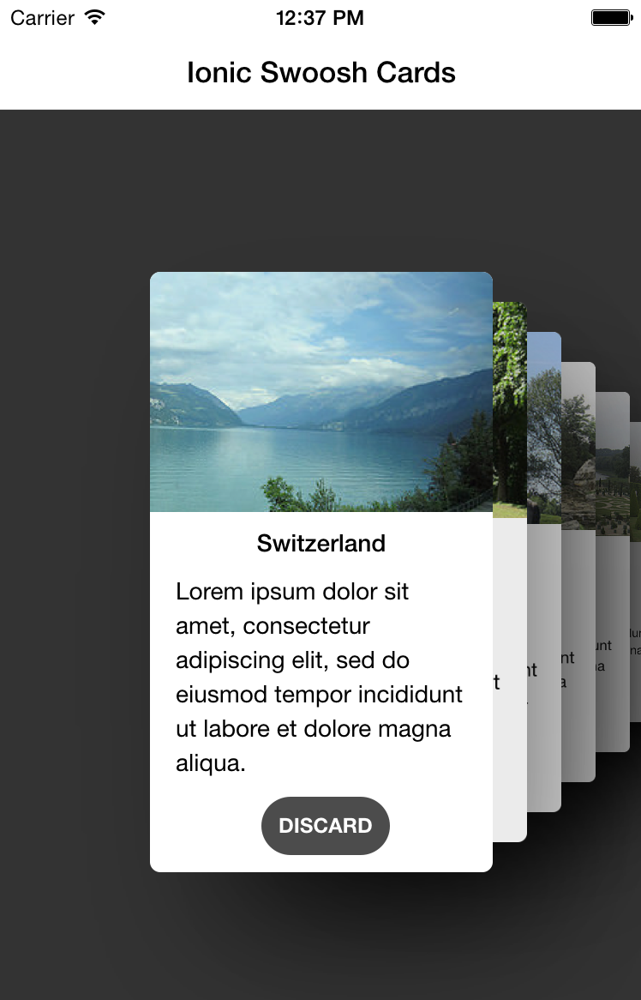

Ionic Contrib: Swoosh Cards
===================

This is an extension of ...

- [Tinder Cards](https://github.com/driftyco/ionic-ion-tinder-cards)
- [Swipe Cards](https://github.com/driftyco/ionic-ion-swipe-cards)
- [Tinder Cards 2](https://github.com/loringdodge/ionic-ion-tinder-cards-2)

...and is reminiscent of the cards found in the National Geographic app.
No partial swiping is permitted and cards swoosh away on discard (click).

[Demo](http://codepen.io/loringdodge/pen/ZGvMxE)



## Install

1. Bower install instructions coming.
2. Include 'ionic.swoosh.cards.js' and 'ionic.swoosh.cards.css' in index.html.

## Usage

```html
<div ng-if="cards.active">
  <swoosh-cards spacing="30">
    <swoosh-card ng-repeat="card in cards.active" on-destroy="cardDestroyed($index)">
      <div ng-controller="CardCtrl">

        <div class="top">
          
        </div>
        <div class="bottom">
          <h1>{{ card.country }}</h1>
          <p>{{ card.text }}</p>
          <div class="discard" ng-click="discard(card)">DISCARD</div>
        </div>
      </div>
    </swoosh-card>

  </swoosh-cards>
</div>
```

To add new cards dynamically, just add them to the cards array:


## Directive Attributes

| Name                   | Scope  | Options    | Action                                                        |
|------------------------|--------|------------|---------------------------------------------------------------|
| `spacing`              | @      | Number     | Number of pixels between each card                            |
